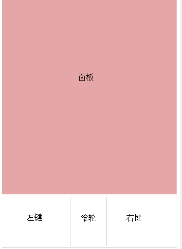

# mouse

这个项目主要是娱乐，之前家里电脑屏幕比较的大，于是躺沙发上看视频，
发现要过去电脑旁点上一集、下一集好烦，如果手机直接控制电脑就好了。
于是尝试写了个小程序，方便使用。

使用方式：

- 如果电脑有安装java运行环境，直接在 release 目录双击jar文件或者转到命令行中执行 `java -jar mouse-jar-with-dependencies.jar`
- 或者直接使用 imouse-windows-0.0.1， 进入目录，双击exe (windows用户)

程序运行之后，填写当前要被控制的电脑的ip,和希望服务时候的端口port（4444除外）：

如下图：

日志区打印了
**[ 2016-11-09 16:51:40 ]	mouse controll server on [ 你的ip ] started success**
之后，在手机中用户浏览器访问
http://ip:port/socket.html (ip和port分别换成填写的ip和端口)

点击手机页面中相应位子操作，其中面板双击确定

